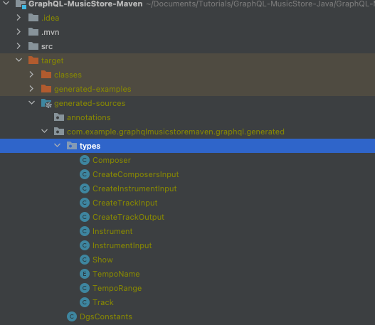
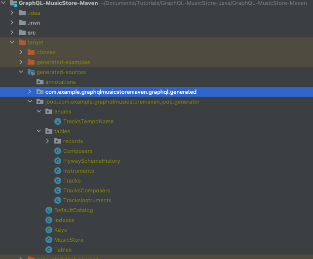
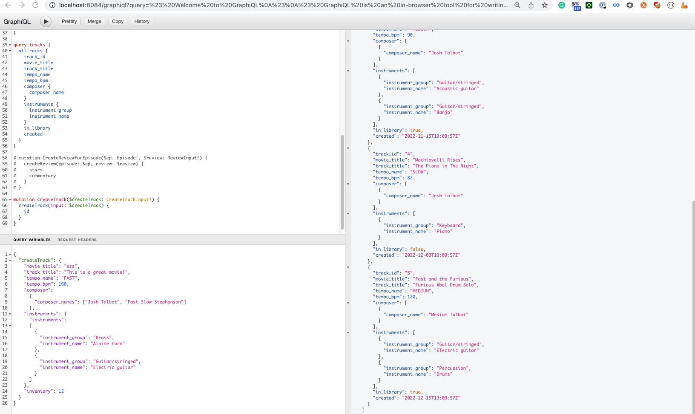
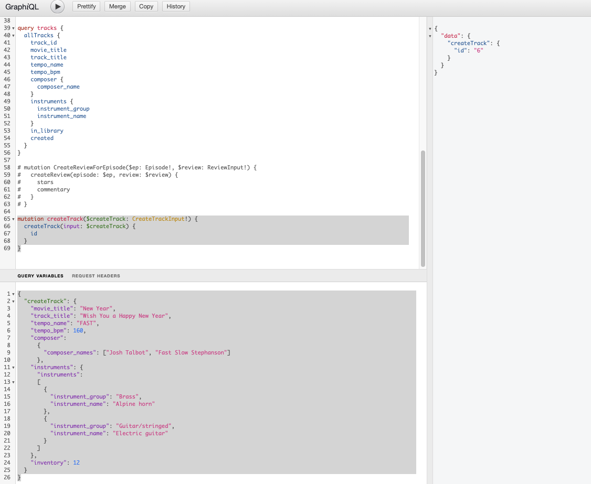

# DGS FlyWay JOOQ MySQL Application

## Premises
I have the following tables.

Track Table

|track_id|movie_title|track_title|tempo_name|tempo_bpm|inventory|created|
|:---: |:---: |:---: |:---: |:---: |:-------:|:-------:|
|1|Starting Out Slow|Stillness of the mind|fast|126|12|1977-03-28 00:00:01'|
|2|1-2 Guitar Hero!|Rhythm of the Night|medium|85|0|'1985-01-02 00:00:02'|
|3|American Reunion|The Slow Slowdown|medium|90|1|'2022-11-15 19:09:57'|
|4|Machiavelli Rises|The Piano in The Night|slow|82|0|'2022-12-03 19:09:57'|
|5|Fast and the Furious|Furious Abel Drum Solo|medium|120|2|'2022-12-15 19:09:57'|

Track Instrument Table

|track_id| instrument_id |
|:---:|:-------------:|
|1|      101      |
|2|      104      |
|3|      102      |
|3|      103      |
|4|      105      |
|5|      104      |
|5|      106      |

Instrument Table

| instrument_id | instrument_group  | instrument_name |
|:---------------:|:--------------------:|:-----------------:|
| 101           | Brass              | Alpine horn     |
| 102           | Guitar/stringed    | Acoustic guitar |
| 103           | Guitar/stringed    | Banjo           |
| 104           | Guitar/stringed    | Electric guitar |
| 105           | Keyboard            | Piano           |
| 106           | Percussion          | Drums           |


Composer Table

| composer_id | composer_name  |
|-------------|----------------|
| 1           | Abel Korzeniowski |
| 2           | Fast Slow Stephanson |
| 3           | Josh Talbot |
| 4           | Medium Talbot |

Track Instrument Table

| track_id | instrument_id |
|:--------:|:-------------:|
|    1     |       1       |
|    2     |       2       |
|    3     |       3       |
|    4     |       4       |
|    5     |       4       |

I want to perform the following GraphQL queries and mutations on these tables:
```graphql
type Query {
    allTracks(
        tempo_name: TempoName
        movie_title: String
        composer_name: String
        instrument_group: String
        instrument_name: String
        tempo_range: TempoRange
        in_library: Boolean
        after: DateTime
    ): [Track!]!
}

type Mutation {
    createTrack(input: CreateTrackInput!): CreateTrackOutput
}
```

## Local Develop Environment

To achieve this we will spin up a docker container containing the Spring Boot Application that will expose the graphql apis and perform data fetching.
And a MySQL database to store the data in the above tables.

First clone this [Local-Developing-Environment](https://github.com/YilengYao/Local-Developing-Environment/tree/music-store-environment), then 
follow this [Read Me](https://github.com/YilengYao/Local-Developing-Environment/blob/music-store-environment/Local-MusicStore-Environment/README.md) to set up your local develop environment.

## Setting up DGS
If you are unfamiliar with DGS you can follow up on this tutorial [Getting Started with DGS using Maven
](https://www.linkedin.com/pulse/getting-started-dgs-using-maven-yi-leng-yao) on setting up DGS.

## Dependencies
Add the following dependencies to you pom.xml

```xml
        <!-- for implementing GraphQL Scalars such as DateTimeScalar -->
         <dependency>
             <groupId>com.netflix.graphql.dgs</groupId>
             <artifactId>graphql-dgs-extended-scalars</artifactId>
         </dependency>
```
We will be dealing with DateTimeScalar in graphql, so we need add `extended-scalars` dependency to implement DateTimeScalar.

```xml
       <!-- Database access -->
         <dependency>
             <groupId>mysql</groupId>
             <artifactId>mysql-connector-java</artifactId>
         </dependency>
```
We need this dependency to connect to our mysql database.

```xml
        <dependency>
             <groupId>org.flywaydb</groupId>
             <artifactId>flyway-core</artifactId>
         </dependency>
```
We need flyway to perform database migration.

```xml
       <dependency>
             <groupId>org.jooq</groupId>
             <artifactId>jooq</artifactId>
         </dependency>
         <dependency>
             <groupId>org.jooq</groupId>
             <artifactId>jooq-meta</artifactId>
             <version>${jooq.version}</version>
         </dependency>
         <dependency>
             <groupId>org.jooq</groupId>
             <artifactId>jooq-codegen</artifactId>
         </dependency>
```
We need jooq to perform database querying, also jooq provide code generation of DTOs that acts as placeholders for results of our sql queries.

### Plugins 
in pom.xml add the following plugins

```xml

             <!-- Add the generated GraphQL types in generated-sources folder to the classpath -->
             <plugin>
                 <groupId>org.codehaus.mojo</groupId>
                 <artifactId>build-helper-maven-plugin</artifactId>
                 <executions>
                     <execution>
                         <phase>generate-sources</phase>
                         <goals>
                             <goal>add-source</goal>
                         </goals>
                         <configuration>
                             <sources>
                                 <source>${project.build.directory}/generated-sources</source>
                             </sources>
                         </configuration>
                     </execution>
                 </executions>
             </plugin>
```
Remember in [Getting Started with DGS using Maven
](https://www.linkedin.com/pulse/getting-started-dgs-using-maven-yi-leng-yao) we added the plugin for code generation.
There generated types is generated in the target/generated-sources folder. The above plugin allows our application to import the generated GraphQL types in our application.



```xml

             <plugin>
                 <groupId>org.apache.maven.plugins</groupId>
                 <artifactId>maven-compiler-plugin</artifactId>
             </plugin>

             <!-- To run flyway migration, executing queries in db/migration -->
             <plugin>
                 <groupId>org.flywaydb</groupId>
                 <artifactId>flyway-maven-plugin</artifactId>
                 <version>${flyway.version}</version>
                 <executions>
                     <execution>
                         <phase>generate-sources</phase>
                         <goals>
                             <goal>migrate</goal>
                         </goals>
                     </execution>
                 </executions>
                 <configuration>
                     <url>${database.url}/${database.schema}</url>
                     <user>${database.user}</user>
                     <password>${database.password}</password>
                     <locations>
                         <location>filesystem:src/main/resources/db/migration</location>
                     </locations>
                 </configuration>
             </plugin>
```

This plugin allows us to run flyway migration by executing queries in the db/migration folder.

```xml
            <!-- To generated JOOQ record types in generated-sources folder -->
             <plugin>
                 <groupId>org.jooq</groupId>
                 <artifactId>jooq-codegen-maven</artifactId>
                 <version>${jooq.version}</version>
                 <executions>
                     <execution>
                         <id>java-generator</id>
                         <phase>generate-sources</phase>
                         <goals>
                             <goal>generate</goal>
                         </goals>

                         <configuration>
                             <jdbc>
                                 <url>${database.url}/${database.schema}</url>
                                 <user>${database.user}</user>
                                 <password>${database.password}</password>
                             </jdbc>
                             <generator>
                                 <database>
                                     <includes>.*</includes>
                                     <dateAsTimestamp>true</dateAsTimestamp>
                                     <inputSchema>${database.schema}</inputSchema>
                                 </database>
                                 <target>
                                     <packageName>${package.name}.jooq.generator</packageName>
                                     <directory>target/generated-sources/jooq</directory>
                                 </target>
                             </generator>
                         </configuration>
                     </execution>
                 </executions>
             </plugin>
```
Allow JOOQ to generated record types in the generated-sources folder. These record types are DTOs that act as placeholder to hold the result of our JOOQ SQL queries.



Please reference [pom.xml](https://github.com/YilengYao/GraphQL-MusicStore-Java/blob/graphql-dgs-flyway-jooq-mysql/GraphQL-MusicStore-Maven/pom.xml)

## GraphQL Schemas
In [Getting Started with DGS using Maven
](https://www.linkedin.com/pulse/getting-started-dgs-using-maven-yi-leng-yao) we have a schema.graphqls, since we are introducing a schema for carts we would want split schema.graphqls into 2 different schema files for tracks and shows queries respectively.
shows.graphqls
```graphql
type Show {
    title: String
    releaseYear: Int
}

extend type Query {
    shows(titleFilter: String): [Show]
}
```
musicstore.graphqls
```graphql
scalar DateTime

enum TempoName {
    FAST
    MEDIUM
    SLOW
}

input TempoRange {
    min_tempo: Int!
    max_tempo: Int!
}

type Track {
    track_id: ID!
    movie_title: String!
    track_title: String!
    tempo_name: TempoName!
    tempo_bpm: Int!
    composer: [Composer]!
    instruments: [Instrument]!
    in_library: Boolean!
    created: DateTime!
}

type Instrument {
    instrument_id: ID!
    instrument_group: String!
    instrument_name: String!
}

type Composer {
    composer_id: ID!
    composer_name: String!
}

type Query {
    allTracks(
        tempo_name: TempoName
        movie_title: String
        composer_name: String
        instrument_group: String
        instrument_name: String
        tempo_range: TempoRange
        in_library: Boolean
        after: DateTime
    ): [Track!]!
}
```

Notice that we have `extend type Query` in shows.graphqls, this is because you can't have 2 Query types unless you extend the Query type.

Since we are replacing schema.graphqls, we need to replace `src/main/resources/schema/musicstore.graphqls` with 
```xml
<configuration>
    <schemaPaths>
        <param>src/main/resources/schema/musicstore.graphqls</param>
        <param>src/main/resources/schema/shows.graphqls</param>
    </schemaPaths>
    <packageName>${package.name}.graphql.generated</packageName>
```
[here](https://github.com/YilengYao/GraphQL-MusicStore-Java/blob/graphql-dgs-flyway-jooq-mysql/GraphQL-MusicStore-Maven/pom.xml#L123)

### Implementing the DateTime Scalar
We need to implement the datetime scalar which is done in [DateTimeScalar.java](https://github.com/YilengYao/GraphQL-MusicStore-Java/blob/graphql-dgs-flyway-jooq-mysql/GraphQL-MusicStore-Maven/src/main/java/com/example/graphqlmusicstoremaven/graphql/types/DateTimeScalar.java)

## Flyway Migration
Flyway is a tool for database migration. First create the directory migration/db in the src/main/resource directory. 
Create the sql scripts in db/migration directory.

V1__create_tables.sql
```sql
CREATE TABLE tracks (
     track_id BIGINT NOT NULL AUTO_INCREMENT,
     movie_title varchar(255) NOT NULL,
     track_title varchar(255) NOT NULL,
     tempo_name ENUM('fast', 'medium', 'slow') NOT NULL,
     tempo_bpm INT NOT NULL,
     inventory INT,
     created TIMESTAMP,
     PRIMARY KEY (track_id)
 )  ENGINE=InnoDB DEFAULT CHARSET=utf8;

 CREATE TABLE composers (
     composer_id BIGINT NOT NULL,
     composer_name varchar(255) NOT NULL,
     PRIMARY KEY (composer_id)
 )  ENGINE=InnoDB DEFAULT CHARSET=utf8;

 CREATE TABLE tracks_composers (
     track_id BIGINT NOT NULL,
     composer_id BIGINT NOT NULL,
     PRIMARY KEY (track_id, composer_id),
     FOREIGN KEY (track_id) REFERENCES tracks(track_id) ON DELETE CASCADE,
     FOREIGN KEY (composer_id) REFERENCES composers(composer_id) ON DELETE CASCADE
 )  ENGINE=InnoDB DEFAULT CHARSET=utf8;

 CREATE TABLE instruments (
     instrument_id BIGINT,
     instrument_group varchar(255),
     instrument_name varchar(255),
     PRIMARY KEY (instrument_id)
 )  ENGINE=InnoDB DEFAULT CHARSET=utf8;

 CREATE TABLE tracks_instruments (
     track_id BIGINT NOT NULL,
     instrument_id BIGINT NOT NULL,
     PRIMARY KEY (track_id, instrument_id),
     FOREIGN KEY (track_id) REFERENCES tracks(track_id) ON DELETE CASCADE,
     FOREIGN KEY (instrument_id) REFERENCES instruments(instrument_id) ON DELETE CASCADE
 )  ENGINE=InnoDB DEFAULT CHARSET=utf8;
```

V2__insert_musicstore_data.sql
```sql
INSERT INTO tracks (movie_title, track_title, tempo_name, tempo_bpm, inventory, created)
 VALUES ('Starting Out Slow', 'Stillness of the mind', 'fast', 126, 12, '1977-03-28 00:00:01'),
        ('1-2 Guitar Hero!', 'Rhythm of the Night', 'medium', 85, 0, '1985-01-02 00:00:02'),
        ('American Reunion', 'The Slow Slowdown', 'medium', 90, 1, '2022-11-15 19:09:57'),
        ('Machiavelli Rises', 'The Piano in The Night', 'slow', 82, 0, '2022-12-03 19:09:57'),
        ('Fast and the Furious', 'Furious Abel Drum Solo', 'medium', 120, 2, '2022-12-15 19:09:57');

 INSERT INTO composers (composer_id, composer_name)
 VALUES (1, 'Abel Korzenoiski'),
        (2, 'Fast Slow Stephanson'),
        (3, 'Josh Talbot'),
        (4, 'Medium Talbot');

 INSERT INTO tracks_composers (track_id, composer_id)
 VALUES (1, 1),
        (2, 2),
        (3, 3),
        (4, 3),
        (5, 4);

 INSERT INTO instruments(instrument_id, instrument_group, instrument_name)
 VALUES (101, 'Brass', 'Alpine horn'),
        (102, 'Guitar/stringed', 'Acoustic guitar'),
        (103, 'Guitar/stringed', 'Banjo'),
        (104, 'Guitar/stringed', 'Electric guitar'),
        (105, 'Keyboard', 'Piano'),
        (106, 'Percussion', 'Drums');

 INSERT INTO tracks_instruments(track_id, instrument_id)
 VALUES (1, 101),
        (2, 104),
        (3, 102),
        (3, 103),
        (4, 105),
        (5, 104),
        (5, 106);
```
These script will create the required tables and initialize the tables in our MySQL database.

## JOOQ
JOOQ is a library that allow us to perform typesafe sql query and dto generation to placehold the sql query results.

#### Code Generation
JOOQ integrates with FlyWay to read the sql scripts in db/migration folder. And according to the queries in the sql script,
it will generated record types in the `generated-source` folder.

#### Connecting to Database
We need to set up a connection be between our application with the database.
Will we set up the connection in [RepositoryConfigurationConfig](https://github.com/YilengYao/GraphQL-MusicStore-Java/blob/graphql-dgs-flyway-jooq-mysql/GraphQL-MusicStore-Maven/src/main/java/com/example/graphqlmusicstoremaven/configuration/RepositoryConfiguration.java) to connect to our MySQL database.
```java
@Bean
DataSource getMysqlDataSource(
            @Value("${mysql.server}") final String serverName,
            @Value("${mysql.database}") final String database,
            @Value("${mysql.port}") final Integer port,
            @Value("${spring.datasource.username}") final String username,
            @Value("${spring.datasource.password}") final String password) {
        MysqlDataSource dataSource = new MysqlDataSource();
        dataSource.setServerName(serverName);
        dataSource.setDatabaseName(database);
        dataSource.setPortNumber(port);
        dataSource.setUser(username);
        dataSource.setPassword(password);
        return dataSource;
        }
```

Where the parameters are defined in our application.properties file
```
spring.datasource.username=user
spring.datasource.password=password
mysql.server=music-store-database
mysql.database=music_store
mysql.port=3306
```

Notice that server corresponds to container name in [docker-compose.yml](https://github.com/YilengYao/Local-Developing-Environment/blob/music-store-environment/Local-MusicStore-Environment/docker-compose.yml) file in the `Local-Developing-Environment
Public` repository. This is because we are using docker's internal networking where the url of the container resolvers to the container name.

Also the username, password, database and port in application.properties also corresponds to the username, password, database and port of docker-compose.yml.

docker-compose.yml
```yaml
  music_store_database:
    image: mysql:8.0.31
    container_name: music-store-database
    environment:
      - MYSQL_USER=user
      - MYSQL_ROOT_PASSWORD=password
      - MYSQL_PASSWORD=password
      - MYSQL_DATABASE=music_store
    ports:
      - '3306:3306'

```

## Resolving GraphQL Queries with Queries to Database
[JooqTrackStore.java](https://github.com/YilengYao/GraphQL-MusicStore-Java/blob/graphql-dgs-flyway-jooq-mysql/GraphQL-MusicStore-Maven/src/main/java/com/example/graphqlmusicstoremaven/repository/jooq/JooqTrackStore.java) contains a code example of how to resolve the GraphQL query and mutation with JOOQ database queries.

## Spin up your App
To spin up you app run
```bash
mvn clean spring-boot:run
```
## Run GraphQL Query
Go to http:localhost:8084/graphiql
and run the following query
```graphql
query tracks {
  allTracks {
    track_id
		movie_title
    track_title
    tempo_name
    tempo_bpm
    composer {
      composer_id
      composer_name
    }
    instruments {
      instrument_id
      instrument_group
      instrument_name
    }
    in_library
    created
  }
}
```


Run the following mutation to create a new track.
```graphql
mutation createTrack($createTrack: CreateTrackInput!) {
  createTrack(input: $createTrack) {
    id
  }
}
```
with query variables
```graphql
{
  "createTrack": {
    "movie_title": "New Year",
    "track_title": "Wish You a Happy New Year",
    "tempo_name": "FAST",
    "tempo_bpm": 160,
    "composer": 
      {
        "composer_names": ["Josh Talbot", "Fast Slow Stephanson"]
      },
    "instruments": {
      "instruments": 
      [
      	{
          "instrument_group": "Brass",
          "instrument_name": "Alpine horn"
        },
        {
          "instrument_group": "Guitar/stringed",
          "instrument_name": "Electric guitar"
        }
      ] 		
    },
    "inventory": 12
  }
}
```


Resultant query after mutation.
